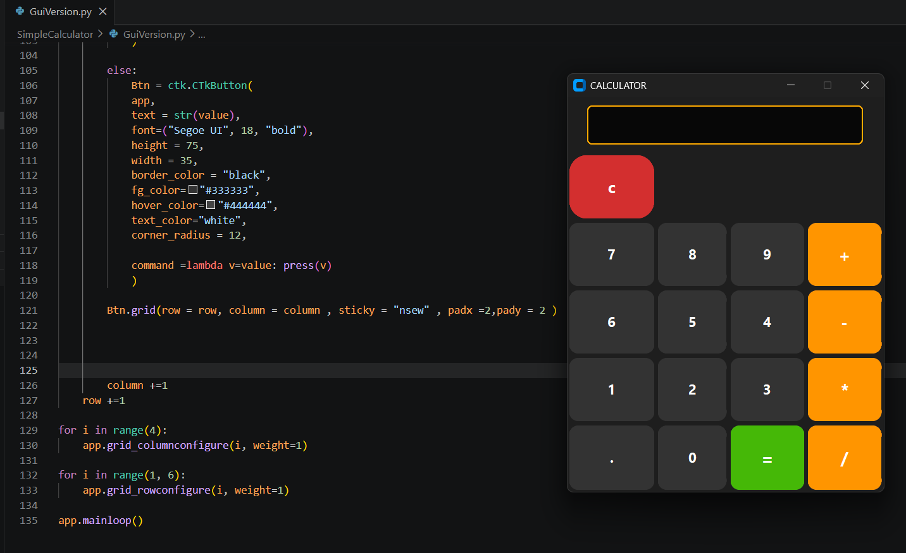

#  CodeSoft Internship Projects

This repository contains the projects I completed during my **CodeSoft Python Internship**.

##  Projects

### 1.  To-Do List Application

Features:
- Add tasks
- Update tasks
- Delete tasks
- Mark tasks as completed
- File handling using JSON
- Persistent task storage

---

### 2.  GUI Calculator

Built with:
- Python
- CustomTkinter

Features:
- Basic arithmetic operations
- Modern GUI design
- Error handling
- Responsive buttons

---

### 3.  Rock Paper Scissors Game

Features:
- Interactive GUI
- Random computer opponent
- Score tracking
- Play Again functionality
- Reset Score feature
- Dynamic result display

---
## 📸 Project Screenshots

### To-Do List App

### Calculator

### Rock Paper Scissors

##  Technologies Used

- Python
- CustomTkinter
- JSON
- Random Module
- Git
- GitHub

---

##  Internship

Completed as part of the **CodeSoft Python Internship Program**.

---

 Feel free to explore the projects and provide feedback!
